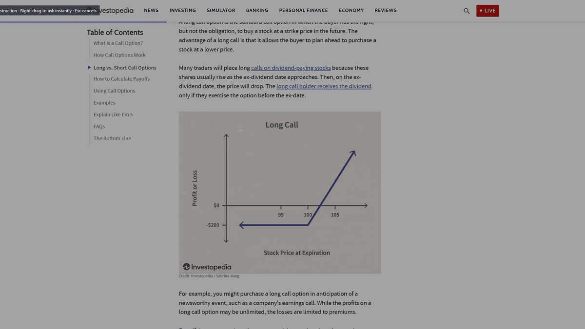

<p align="center">
  
</p>

<h1 align="center">ClipAsk</h1>

<p align="center"><strong>Clip your screen. Ask ChatGPT.</strong></p>

<p align="center">
  <a href="https://github.com/IceyFoxes/ClipAsk/releases"></a>
  <a href="LICENSE"></a>
</p>

ClipAsk is a free, open-source Windows utility for asking ChatGPT about a selected part of your screen. It keeps the interaction short: select something, read the answer, and return to your work.

<p align="center">
  <a href="docs/assets/clipask-demo.mp4?raw=1"></a>
</p>

<p align="center"><sub>11-second synthetic example rendered by ClipAsk. Click the preview for the H.264 video. No live account request was made.</sub></p>

## Install

Download [ClipAsk 0.1.0 Beta 4](https://github.com/IceyFoxes/ClipAsk/releases/tag/v0.1.0-beta.4). The installer is the easiest option; the ZIP is a portable alternative.

- Windows 10 or 11 on x64
- A ChatGPT account with Codex access
- An internet connection for answers

The installer and portable ZIP include the required .NET and Codex runtime files. You do not need to install either separately. The installer is per-user and does not require administrator access.

The current beta is unsigned, so Windows SmartScreen may show an unknown-publisher warning. Verify the adjacent SHA-256 checksum before running it. GitHub builds do not update automatically. A Microsoft Store release is being prepared.

## Use

1. Start ClipAsk and select **Connect ChatGPT**. Sign in through the managed browser flow.
2. Press **Ctrl+Alt+S**.
3. Select the part of the screen you want to ask about.

Use the mouse button that fits the task:

- **Left-drag** opens an instruction field before sending.
- **Right-drag** sends the completed selection immediately when connected.
- **Esc** cancels the selection without sending it.

Every valid capture is copied to the Windows clipboard. Answers stream into a resizable window that supports Markdown, tables, code blocks, and LaTeX. The screenshot scales with the window without changing its proportions, and the result can be minimized while the response is still arriving.

## Features

- Capture a region from any visible desktop application.
- Add a one-time instruction or ask immediately.
- Choose from eligible models and reasoning levels advertised by your account.
- Copy answers or captures, and save captures as PNG files.
- Keep ClipAsk available through the system tray and optionally start it with Windows.
- View available account usage details from the menu.

ClipAsk handles one capture and one response at a time. It does not include follow-up chat, OCR, screenshot history, or editing tools.

## Account and privacy

ClipAsk uses the official managed ChatGPT browser sign-in. It does not ask for an API key or store your password. The managed sign-in token is protected by Windows Credential Manager so you can remain connected.

Captures stay local until you complete a capture and answer action. A left-drag waits for you to press **Send**; a right-drag sends after you release a valid selection. Requests go through the bundled Codex runtime and count toward your ChatGPT account limits. ClipAsk has no developer-operated server and no app-level analytics.

See [Privacy](PRIVACY.md) for details about local state, the clipboard, saved files, and provider processing. ClipAsk is independent software and is not affiliated with or endorsed by OpenAI.

## Build on Windows

Development requires Windows, the .NET **10.0.401 SDK** specified in `global.json`, Git, and the official native Windows **Codex CLI 0.151.0** executable. Download the matching Windows architecture from the [official Codex release](https://github.com/openai/codex/releases/tag/rust-v0.151.0). Do not use an unverified third-party binary.

```powershell
git clone https://github.com/IceyFoxes/ClipAsk.git
cd ClipAsk
dotnet build ClipAsk.slnx -c Release --nologo
dotnet test tests/ClipAsk.Core.Tests/ClipAsk.Core.Tests.csproj -c Release --no-build
$env:CLIPASK_CODEX_PATH = 'C:\path\to\codex.exe'
dotnet run -c Release --project src/ClipAsk.Desktop/ClipAsk.Desktop.csproj
```

Without `CLIPASK_CODEX_PATH`, the app expects `codex.exe` beside `ClipAsk.exe`. The optional `CLIPASK_STATE_DIR` variable overrides runtime storage and must point to a local Windows drive, not a WSL or UNC share.

### Project-local development setup

The development scripts expect a provisioned Windows SDK under `.devin/tools/dotnet-win` and Codex under `.devin/tools/codex-win`. These ignored tools are not included when you clone the repository.

```bash
bash scripts/dev.sh run
bash scripts/dev.sh verify
```

The WSL launcher translates paths into Windows form. Verification builds the Release configuration, runs focused tests, renders synthetic UI cases, and checks the isolated provider configuration. It does not send a live screenshot question or run a model benchmark. Native Windows equivalents are `scripts/run.ps1` and `scripts/verify.ps1`, subject to the normal PowerShell execution policy.

## Package a Windows release

Release packages are self-contained. Packaging requires the project-local .NET SDK and the complete pinned Codex runtime tree described above.

```bash
bash scripts/package.sh
```

On native Windows, run `scripts/package.ps1`. Pass `-BuildInstaller`, or set `BUILD_INSTALLER=1` for the bash launcher, when Inno Setup 6 is installed.

Packaging verifies the Codex runtime allowlist and hashes, removes symbols, embeds the corresponding ClipAsk source, and runs the published executable's synthetic UI and isolated provider checks. Release files are written under `artifacts/releases`; validation evidence is written under `artifacts/validation`. Packaging rejects tracked changes by default so that the embedded source commit identifies the corresponding source. `ALLOW_DIRTY=1` for bash or `-AllowDirty` for PowerShell writes local test packages under `artifacts/local-releases`.

The installer can start ClipAsk with Windows through a checked-by-default setup option. Uninstalling removes that startup entry and keeps account state and preferences by default. The interactive uninstaller offers a separate option to sign out and remove `%LOCALAPPDATA%\ClipAsk`.

Microsoft Store submission uses a separate unsigned MSIX that Microsoft signs after acceptance. It requires the exact identity assigned in Partner Center and a Windows SDK installation containing `MakeAppx.exe`. See the [Store preparation guide](store/README.md); do not guess or commit account-specific identity values.

## Project structure

- `src/ClipAsk.Core`: capture geometry, response layout, provider policy, prompts, and streaming protocol
- `src/ClipAsk.Desktop`: WPF UI, Windows capture, hotkeys, tray integration, and response rendering
- `tests/ClipAsk.Core.Tests`: provider, protocol, policy, and geometry tests
- `docs`: interaction design and release notes

The stack is C#/.NET 10, WPF, Win32 interop, Markdig, WpfMath, and a pinned Codex app-server process.

## Contribute

Bug reports and focused pull requests are welcome. See [CONTRIBUTING.md](CONTRIBUTING.md) before making a change. If ClipAsk is useful to you, a GitHub star helps other people find it.

## License

Copyright (c) 2026 IceyFoxes and ClipAsk contributors.

ClipAsk is licensed under **GNU GPL version 3 only**, SPDX identifier `GPL-3.0-only`. See [LICENSE](LICENSE). Commercial use is allowed, and distributed derivatives must meet the GPLv3 source and licensing requirements. Dependencies keep their own licenses; see [THIRD-PARTY-NOTICES.md](THIRD-PARTY-NOTICES.md). The software comes without a warranty.
